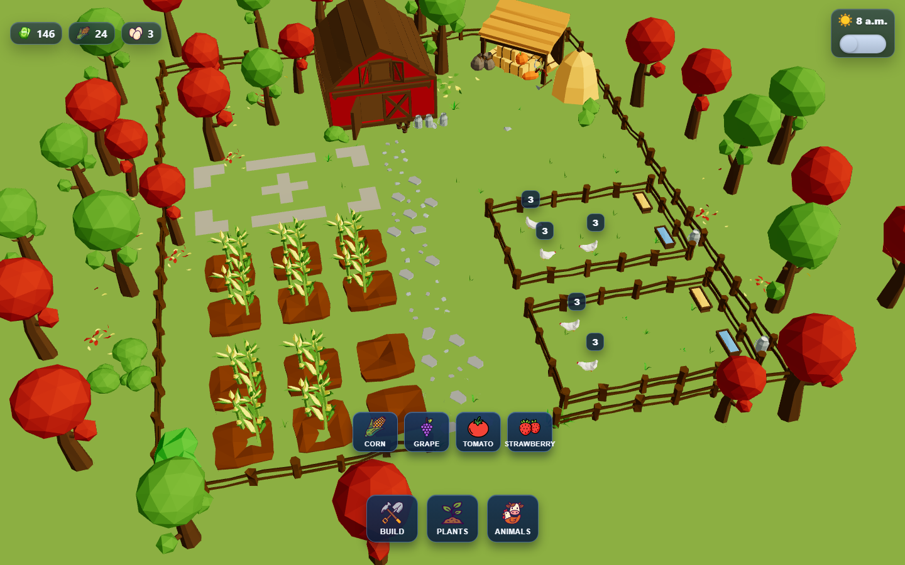
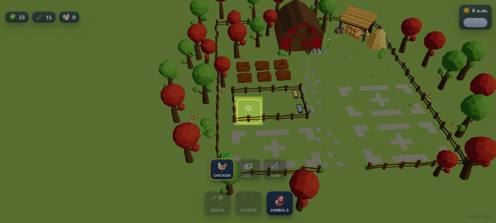
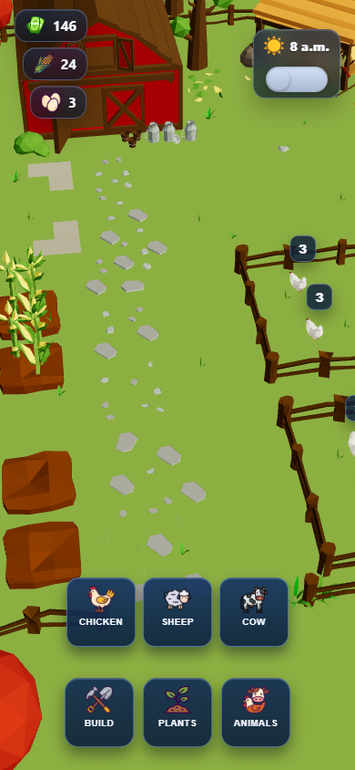

# Garden Designer

Garden Designer is a 3D casual farm prototype built with Three.js and GSAP.
Players build gardens and pens, plant crops, place animals, and harvest resources in a guided tutorial flow.

## Features
- Interactive 3D world with placement, growth, and harvest loops
- Step-by-step onboarding tutorial with spotlight guidance
- Day/night cycle with time acceleration
- Resource UI, flying reward icons, and sound feedback
- Mobile-aware camera and control tuning

## Screenshots
Desktop gameplay:



Desktop tutorial flow:



Mobile gameplay:



## Architecture
Core runtime is organized under `src/World`:

- `World.js`: composition root (camera, renderer, loop, managers)
- `systems/`: renderer, loop, controls, resize behavior
- `game/`: gameplay managers (`GameManager`, entities, structures, interaction)
- `components/`: 3D object factories and scene elements
- `tutorial/`: tutorial manager and step state machine
- `ui/`: UI bootstrap and overlay logic

## Performance Notes
Implemented optimizations:

- Shared GLTF cache and cloning through `AssetLoader`
- Lazy-loaded tutorial module (separate chunk)
- Vendor chunk split in Vite build config
- Background preload of core models
- Reduced hot-path allocations in camera/entity updates
- Runtime perf overlay for FPS and render stats

Enable perf overlay:

- Dev mode: shown automatically
- Prod/preview: add `?debug=1` to URL

## CI
GitHub Actions workflow runs on push/PR:

1. `npm ci`
2. `npm run lint`
3. `npm run build`
4. `npm run test:e2e`

Workflow file: `.github/workflows/ci.yml`

## Getting Started
```bash
npm install
npm run dev
```

Build production bundle:
```bash
npm run build
```

Run end-to-end tests:
```bash
npm run test:e2e
```

Run e2e in headed mode:
```bash
npm run test:e2e:headed
```

Capture README screenshots (manual, local):
```bash
npm run capture:screenshots
```

## Test Coverage
Current Playwright e2e suite validates:

- app bootstrapping and debug hooks availability
- core tutorial/gameplay flow (build + plant + CTA reachability)
- harvest edge case: clicking chicken counter does not grant eggs when not ready
- mobile layout quality (button sizing, spotlight, CTA typography)

## Tech Stack
- Three.js
- GSAP
- Vite
- Vanilla JavaScript (ES modules)

## License
MIT

Copyright (c) Maksim Nikulnikov
